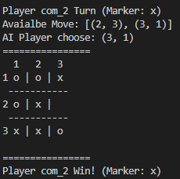

# Tac Tac Toe Machine Learning Project

The following project is self-interested project, playing with reinforcement learning with simple Tic Tac Toe game.  

## Run Training

`python tictactoe.py train`

Default training iteration is 50000

For more training round
`python tictactoe.py train --iteration 50000`

And it will generate o_AI and x_AI for AI playing with marker O and AI playing with marker X.

## Play a game

`python tictactoe.py play --o 1 --x 0`

For parameter o and x
1: Human Player
0: AI player
